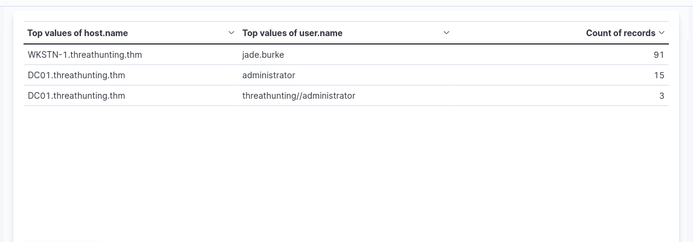
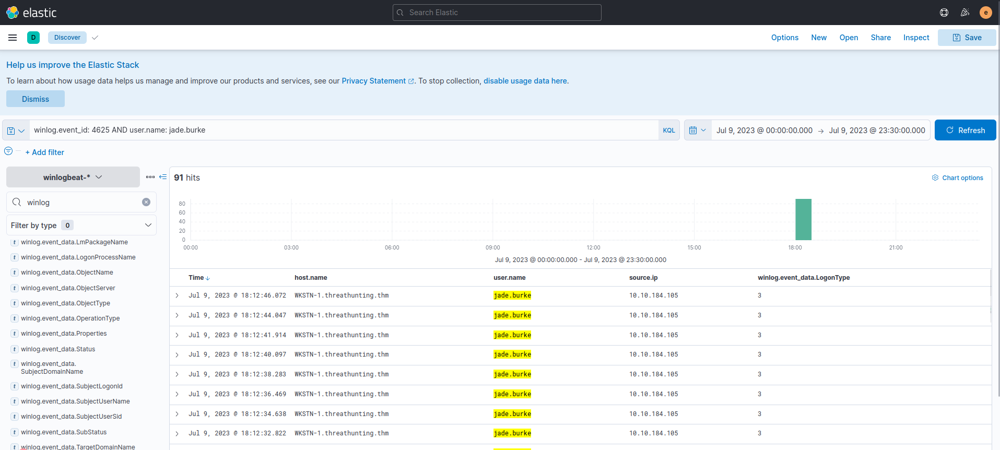
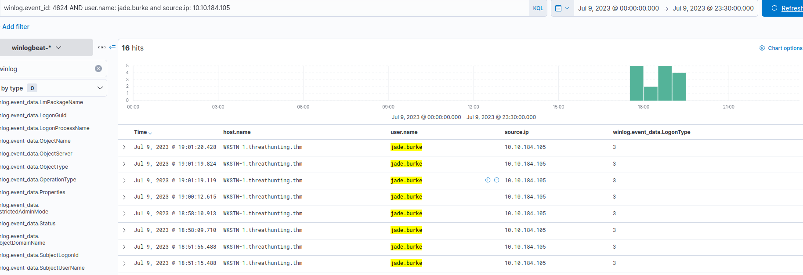
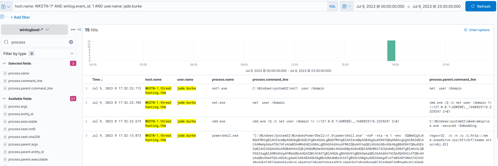

# Hunting for Brute-Forcing Accounts
we will use the winlogbeat-* index to hunt for account brute-forcing activity from all hosts on July 9, 2023.

Brute-force attacks manifest as multiple failed authentication attempts followed by a successful login, which can be detected by correlating authentication events.
---

To start hunting, use the Visualize Library again and create a visualisation table using Lens. Ensure that the table is configured with the following:

- Set the Table Index (winlogbeat), Rows (host.name and user.name), and Metrics (count).

**KQL** : winlog.event_id: 4625

Based on the results, it can be seen that the account of jade.burke has generated numerous failed login attempts to WKSTN-1. The number generated seems unusual and needs further investigation.

---
Let's focus on this information and use the Discover tab to expand the details about this activity. 

**KQL** : winlog.event_id: 4625 AND user.name: jade.burke

In addition, ensure that the following fields are added as columns to aid us in our investigation:

- host.name
- user.name
- source.ip
- winlog.event_data.LogonType

Based on the results, it can be seen that the failed authentication attempts are coming from 10.10.184.105, and the logon type is 3 (Network), which indicates that the account is authenticating to a service from a network.

---
To confirm if the user has successfully authenticated after a potential brute-forcing attempt, we can replace the KQL query with Event ID 4624 and focus on authentication attempts coming from 10.10.184.105.

**KQL** : winlog.event_id: 4624 AND user.name: jade.burke and source.ip: 10.10.184.105

Based on the results, we can see that the user has successfully accessed WKSTN-1. To expand our investigation, we can then check the processes spawned by this user inside the workstation.

 Let's use this KQL query to see the processes spawned by the user on WKSTN-1:

**KQL** :   host.name: WKSTN-1* AND winlog.event_id: 1 AND user.name: jade.burke

ensure that the following fields are added as columns to aid us in our investigation:

- process.parent.command_line
- process.command_line

Based on the results, it can be observed that the user has executed unusual commands inside WKSTN-1. This proves the suspicion that the account of jade.burke was brute-forced and was successfully used to authenticate and execute malicious commands on WKSTN-1.