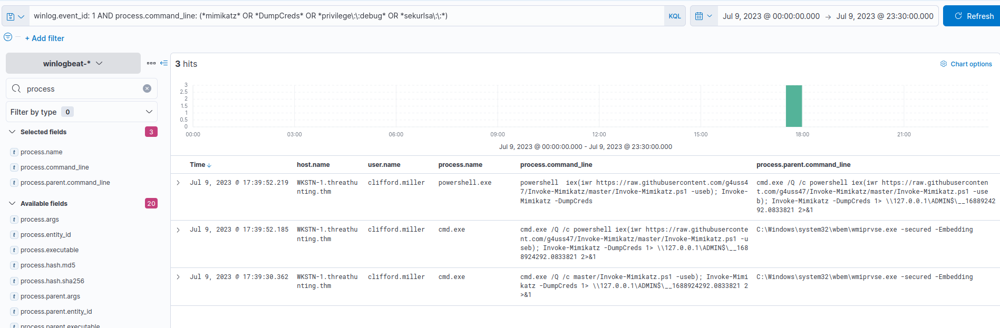
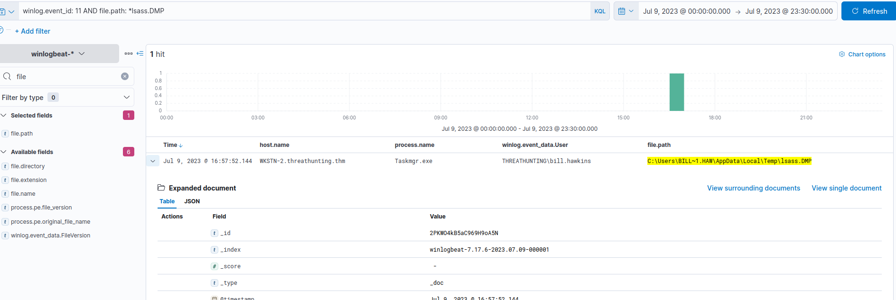

# Hunting LSASS Credential Dumping

we will use the winlogbeat-* index to hunt for potential LSASS credential dumping from all hosts on July 9, 2023

After gaining elevated privileges, attackers often dump the LSASS process to steal in-memory credentials, which are then reused to move laterally and compromise additional systems.

---
Why LSASS is the target

lsass.exe = Local Security Authority Subsystem Service.

Windows uses it to:

- Authenticate users

- Store credentials in memory

That memory can contain:

- Plaintext passwords (sometimes)

- NTLM hashes

- Kerberos tickets

## Mimikatz

- A tool that directly talks to LSASS memory.

- Pulls credentials instantly.

- Loud, well-known, heavily detected.
---

## Hunting Mimikatz Execution

**KQL** : winlog.event_id: 1 AND process.command_line: (* mimikatz * OR * DumpCreds * OR * privilege\:\:debug * OR * sekurlsa\:\: *)

**Note**: The above are known strings used in the command_line query to dump credentials via Mimikatz.

In adition, ensure that the following fields are added as columns to aid us in our investigation:

- host.name
- user.name
- process.parent.command_line
- process.name
- process.command_line

Based on the results, it can be seen that there has been an attempt to dump LSASS credentials from WKSTN-1. Moreover, the attacker used the PowerShell version of Mimikatz (Invoke-Mimikatz.ps1), downloaded from GitHub.

## Hunting LSASS Process Dumping

Attackers may dump lsass.exe via Task Manager instead of Mimikatz, leaving detectable dump files in C:\Users\ *\AppData\Local\Temp\ named processname.DMP.

**KQL** : winlog.event_id: 11 AND file.path: *lsass.DMP

In addition, ensure that the following fields are added as columns to aid us in our investigation:

- host.name
- winlog.event_data.User
- process.name
- file.path

Based on the results, the account bill.hawkins dumped the LSASS process and created a file in his AppData\Local\Temp directory. The attacker can use this dump file to retrieve stored credentials inside the LSASS process.
