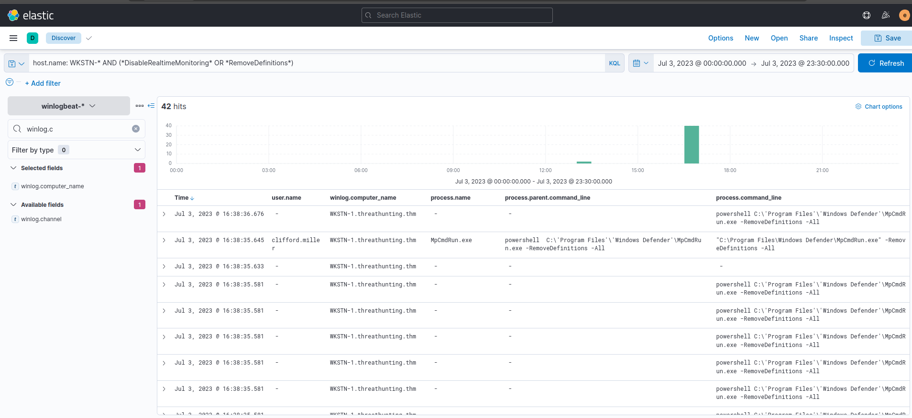
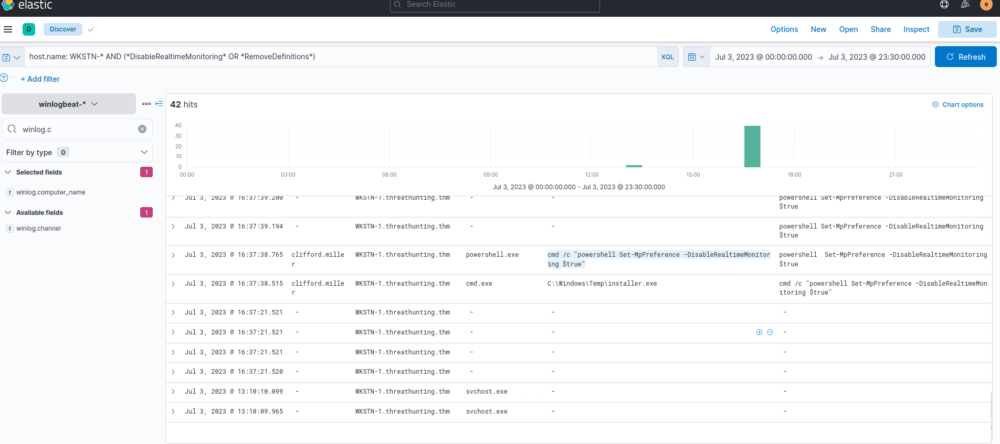

# Hunting of Disabling Security Software

We will use the winlogbeat-* index and hunt for attempts to disable security software, such as Windows Defender, from employee workstations on July 3, 2023.

We will focus on known commands used to disable Windows Defender.

e will hunt events indicating an attempt to disable the running host antivirus:

## Evidence
**KQL** : host.name: WKSTN-* AND (* DisableRealtimeMonitoring * OR * RemoveDefinitions *)

we will use the following fields as columns to aid in our analysis:

* winlog.computer_name
* user.name
* process.parent.command_line
* process.name
* process.command_line

RemoveDefinitions - Commonly used with built-in MpCmdRun.exe to remove all existing signatures of Windows Defender.
---

DisableRealtimeMonitoring - Commonly used with PowerShell's Set-MPPreference to disable its real-time monitoring.

## conclusion

Based on the results, it indicates that a malicious actor has attempted to disable Windows Defender's detection capability.