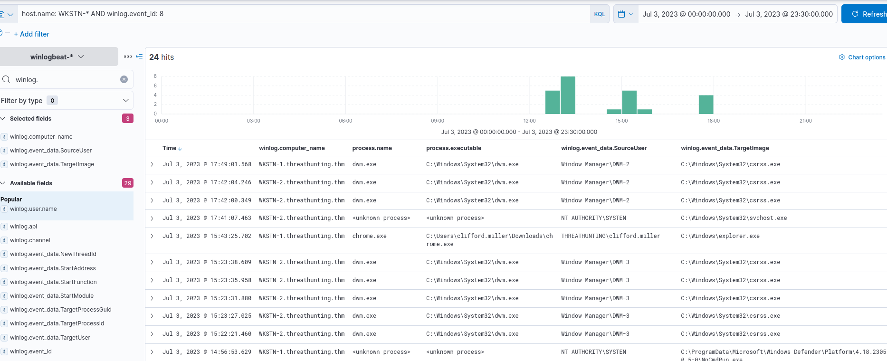

# Hunting of Execution through Process Injection

 we will use the winlogbeat-* index and hunt for potential process injection from employee workstations on July 3, 2023.

 Process Injection means: *Forcing malicious code to run inside another legitimate process.*

## Evidence

Sysmon Event ID 8 triggers when: **One process creates a thread inside another process.**

 We will use the following KQL query to hunt this behaviour: 

 **KQL** : host.name: WKSTN-* AND winlog.event_id: 8

Moreover, we can use the following fields as columns to aid in our analysis:

* winlog.computer_name
* process.executable
* winlog.event_data.SourceUser
* winlog.event_data.TargetImage

## conclusion
Based on the analysis, the executable C:\Users\clifford.miller\Downloads\chrome.exe initiated a remote thread creation against explorer.exe.