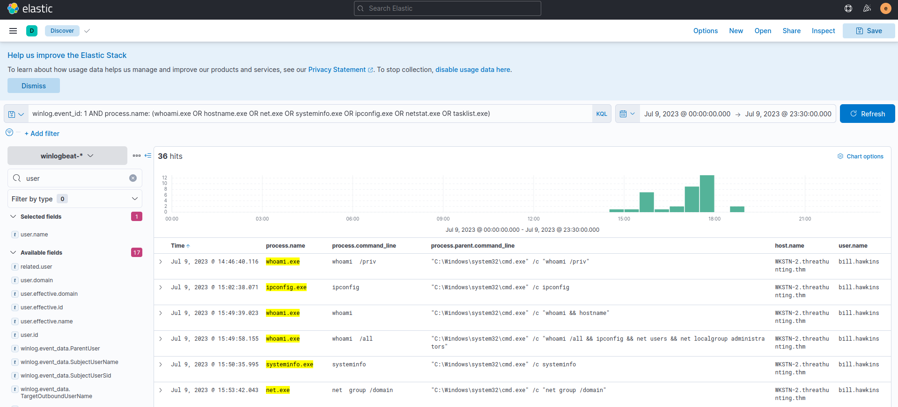
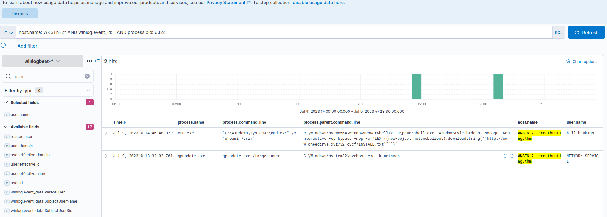

# Hunting for Host reconnaissance

we will use the winlogbeat-* index to hunt for unusual behaviours of host information reconnaissance from all hosts on July 9, 2023.

Using the Discover tab, we will focus on the following command-line tools:

* whoami.exe
* hostname.exe
* net.exe
* systeminfo.exe
* ipconfig.exe
* netstat.exe
* tasklist.exe

## Evidence

By using the following KQL query, we will hunt process creations (Sysmon Event ID 1) generated by these two tools:

**KQL** : winlog.event_id: 1 AND process.name: (whoami.exe OR hostname.exe OR net.exe OR systeminfo.exe OR ipconfig.exe OR netstat.exe OR tasklist.exe)

In addition, ensure that the following fields are added as columns to aid us in our investigation:

- host.name
- user.name
- process.parent.command_line
- process.command_line

Based on the results, it can be seen that bill.hawkins has executed multiple enumeration tools on WKSTN-2. Moreover, all commands were spawned by cmd.exe.

 Let's continue the investigation by diving deeper into the cmd.exe process.

Using this parent PID, we can create a new KQL query focusing on the cmd.exe process creations on WKSTN-2 related to the enumeration commands used

**KQL** : host.name: WKSTN-2* AND winlog.event_id: 1 AND process.pid: 6324

## conclusion

 Based on the results,this may indicate that the script downloaded by the PowerShell script may be a reverse shell script or a command and control agent, which confirms the suspicion of enumeration commands executed on WKSTN-2.

