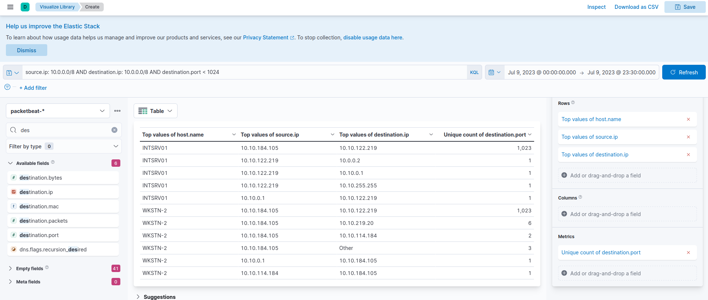
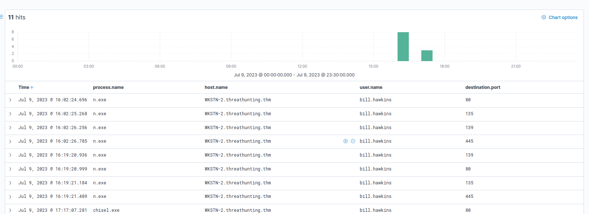

# Hunting for Internal Network Scanning

we will use the packetbeat-* index to hunt for unusual internal network connections from all hosts on July 9, 2023.

To start hunting, use the Visualize Library and create a visualisation table using Lens.

## Evidence

configure the table with the following setup:

- Set the Table Index (packetbeat), Rows (host.name, source.ip and destination.ip), and Metrics (Unique count of destination.port).

**KQL** : source.ip: 10.0.0.0/8 AND destination.ip: 10.0.0.0/8 AND destination.port < 1024

These two hosts (INTSRV01 AND WKSTN-2) are highly notable since they generated connections to 1023 unique destination ports.

winlogbeat-* index using the Discover console and correlate this network activity to associated processes.

 Let's use the following KQL query to identify the process that initiated the network connections, specifying the source and destination address.

 **KQL** : winlog.event_id: 3 AND source.ip: 10.10.184.105 AND destination.ip: 10.10.122.219 AND destination.port < 1024

 In addition, ensure that the following fields are added as columns to aid us in our investigation:

- host.name
- user.name
- process.name
- destination.port

**Note: Only successful connections established are logged by Sysmon Event ID 3, meaning all these ports logged were identified as open.**

## conclusion

Using Sysmon Event ID 3 (Network Connection), we were able to correlate the potential port scanning activity to a process named n.exe. Moreover, it can be concluded that the originating host is from WKSTN-2 and the target is INTSRV01. This activity seems suspicious since all these connections were initiated by a user account, not a system or service account