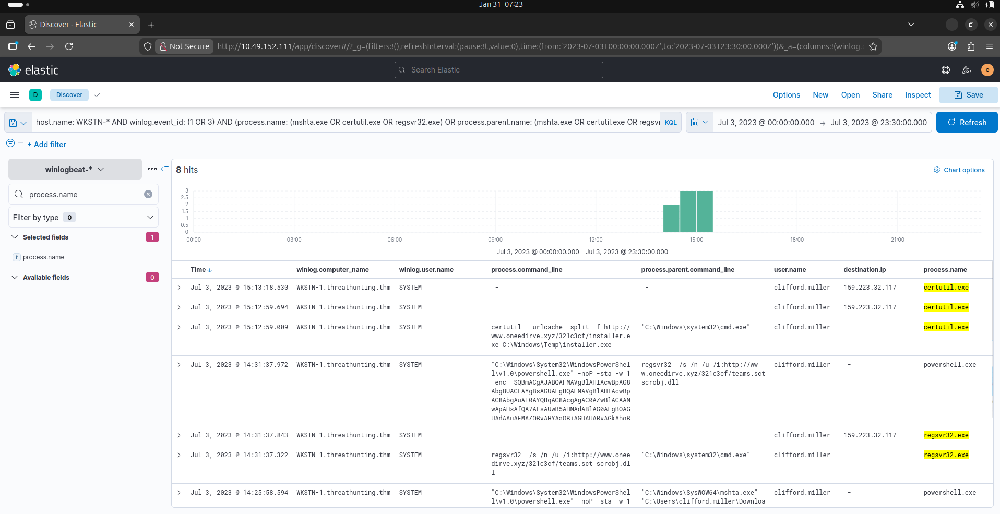

# Hunting suspicious usage of build-in system tools.
we will still use the winlogbeat-* index and hunt for executions of built-in Windows binaries from employee workstations on July 3, 2023.

Aside from PowerShell and Command Prompt binaries, other built-in binaries are also abused by threat actors to execute malicious commands.

we will hunt usage of built-in binaries **(Certutil, Mshta, and Regsvr32)** and investigate unusual commands executed and network connections initiated.

## Evidence 

**KQL** : host.name: WKSTN-* AND winlog.event_id: (1 OR 3) AND (process.name: (mshta.exe OR certutil.exe OR regsvr32.exe) OR process.parent.name: (mshta.exe OR certutil.exe OR regsvr32.exe))

add the following fields as columns to aid in our analysis:

* winlog.computer_name
* user.name
* process.parent.command_line
* process.name
* process.command_line
* destination.ip

## conclusion
Based on the results, it can be observed that all three binaries were suspicious due to their usage

* Certutil was used to download a binary (installer.exe), which is then stored in C:\Windows\Temp. 
* Regsvr32 accessed a remote file (teams.sct), then spawned a suspicious encoded PowerShell command.
* Mshta spawned a suspicious encoded PowerShell command.

