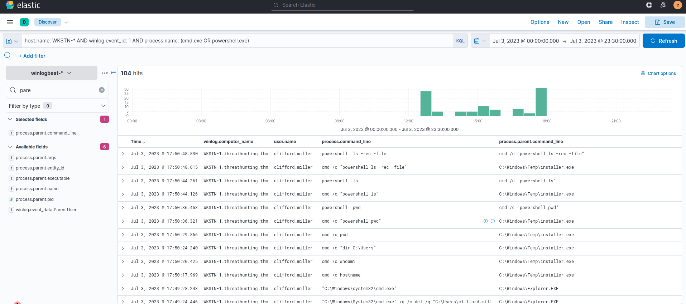
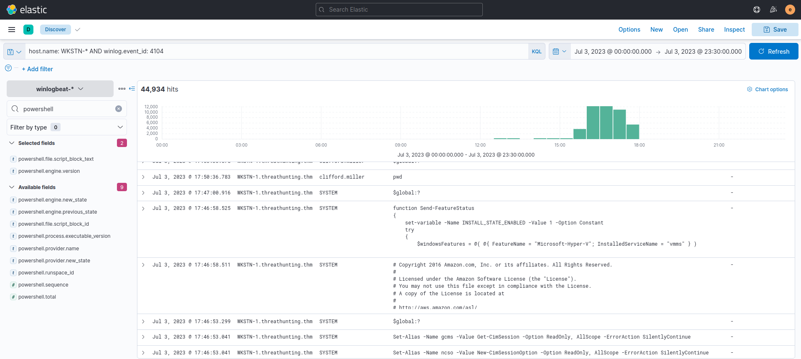

# Hunting suspicious usage of command-line tools.

We will use the winlogbeat-* index and hunt for executions of built-in Windows command-line tools, such as PowerShell and Command Prompt, from employee workstations on July 3, 2023.

We will hunt process creations (Sysmon Event ID 1) generated by these two tools:

1. powershell
2. cmd

**KQL** : host.name: WKSTN-* AND winlog.event_id: 1 AND process.name: (cmd.exe OR powershell.exe)

the following fields are added as columns to aid us in our investigation:
* winlog.computer_name
* user.name
* process.parent.command_line
* process.command_line

## Evidence

The execution of cmd.exe by C:\Windows\Temp\installer.exe seems to be unsual.

To add on PowerShell analysis We can use the following KQL syntax to list all events generated by it:

**KQL** : host.name: WKSTN-* AND winlog.event_id: 4104

Moreover, we can use the following fields as columns to aid in our analysis:

* winlog.computer_name
* winlog.user.name
* powershell.file.script_block_text

## conclusion

Some examples of PowerShell strings are provided below:
* invoke / invoke-expression / iex
* -enc / -encoded
* -noprofile / -nop
* bypass
* -c / -command
* -executionpolicy / -ep
* WebRequest
* Download

once these strings are seen in the logs, it is still recommended to validate the events.

