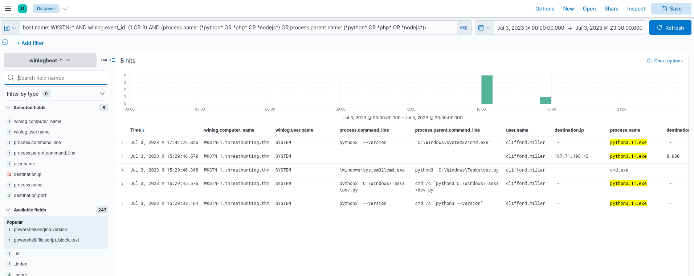

# Hunting suspicious usage of scripting and programming tools.

we will continue using the winlogbeat-* index and hunt for suspicious usage of scripting/programming tools from employee workstations on July 3, 2023.

we will hunt for unusual events generated by programming tools like Python, PHP and NodeJS. 

## Evidence
we will use the following KQL query to hunt process creation (Sysmon Event ID 1) and network connection (Sysmon Event ID 3) events:

**KQL** : host.name: WKSTN-* AND winlog.event_id: (1 OR 3) AND (process.name: (*python* OR *php* OR *nodejs*) OR process.parent.name: (*python* OR *php* OR *nodejs*))

# conclusion
Based on the results, it can be observed that Python was used to do the following:  
*Spawn a child cmd.exe process and initiate network connection with 167.71.198.43:8080*  

