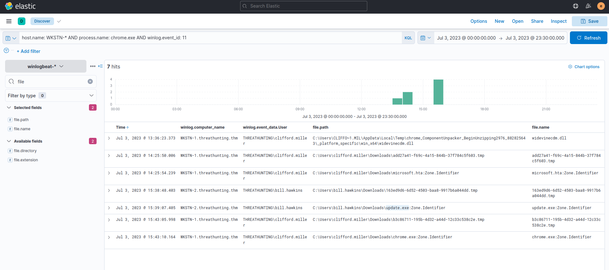
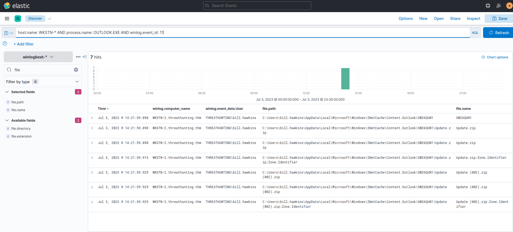
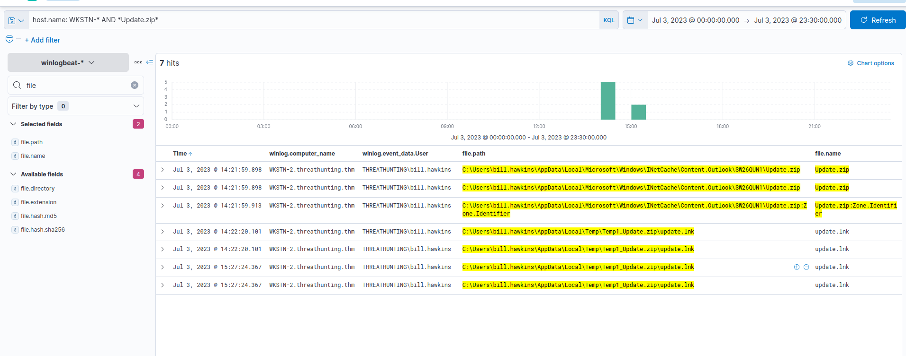

## Hunting Phishing Links and Attachments

we will use the winlogbeat-* index and hunt for indicators of malicious links and attachments being opened or downloaded from employee workstations on July 3, 2023

---
Phishing emails containing malicious links or attachments of malware payloads are either downloaded or opened directly from the email client before being executed.

# Evidence
## 1. Files Downloaded using Chrome

Using the Discover tab, we will first focus on phishing links downloaded using a web browser.

 By using the following KQL query, we will hunt file creations (Sysmon Event ID 11) generated by chrome.exe:

**KQL** : host.name: WKSTN-* AND process.name: chrome.exe AND winlog.event_id: 11

we will add following columns:

* winlog.computer_name

* winlog.event_data.User

* file.path

**NOTE** : We can ignore the .tmp files created by Chrome. By default, chrome.exe creates a temporary file when a file is being downloaded.
# conclusion
Based on this result,We can confirm if these files are suspicious:

* C:\Users\clifford.miller\Downloads\chrome.exe
* C:\Users\clifford.miller\Downloads\microsoft.hta
* C:\Users\bill.hawkins\Downloads\update.exe

# Evidence
## 2. Files Opened using Outlook

payloads are also delivered via phishing emails, we will hunt phishing attachments opened using an Outlook client.

I will use the following KQL query to track files created by the Outlook client:

**KQL** : host.name: WKSTN-* AND process.name: OUTLOOK.EXE AND winlog.event_id: 11

Based on the results, an attachment named **Update.zip** was opened, which was temporarily stored in the \AppData\Local\Microsoft\Windows\INetCache\Content.Outlook\ directory.

To confirm the zip file's contents, we can use the following KQL query to find events connected to it:

**KQL** : host.name: WKSTN-* AND *Update.zip*

# conclusion
Based on the results, we confirm that an LNK file exists from the archive. A shortcut file (.lnk) archived to zip is a typical malware attachment.

