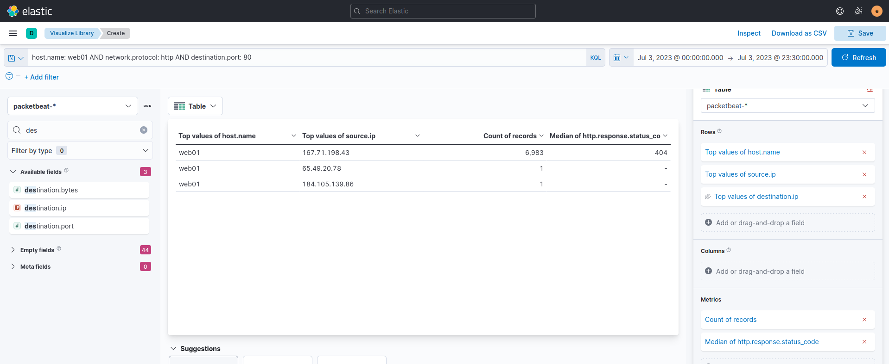
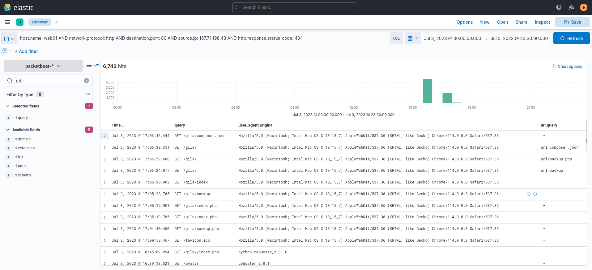
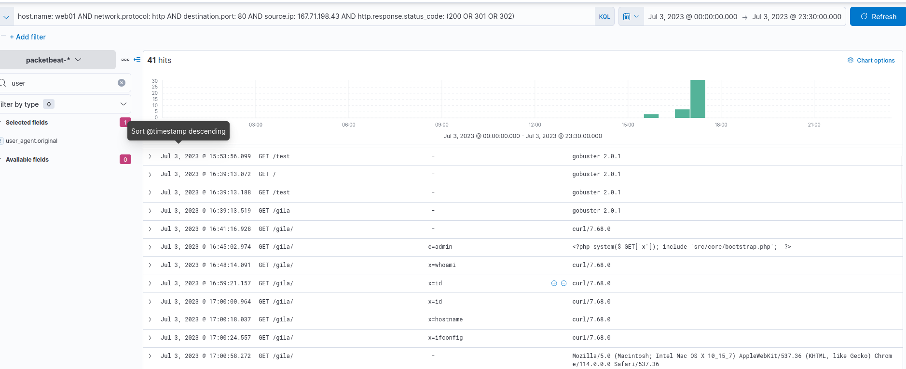

## # Hunting suspicious activities indicating initial user or host compromise(web app).

we will use the packetbeat-* index and hunt for suspicious actors attacking our web application (web01) on July 3, 2023.

To start hunting, I will use the Visualize Library again and create a visualisation table using Lens

## Evidence

**KQL** : host.name: web01 AND network.protocol: http AND destination.port: 80

 it can be observed that the query provided a high count of status code 404, indicating a directory enumeration attempt by 167.71.198.43 since the attack produces many "Page Not Found" results due to its behaviour of guessing valid endpoints.

To better understand the attack, we can continue the investigation using the Discover tab with a query focused on status code 404 and the attacker's IP address.

**KQL** : host.name: web01 AND network.protocol: http AND destination.port: 80 AND source.ip: 167.71.198.43 AND http.response.status_code: 404

Based on the results ,the attacker used Gobuster to enumerate the directories in the web application and eventually focused on the /gila directory,

To focus on valid endpoints accessed by the attacker

**KQL** : host.name: web01 AND network.protocol: http AND destination.port: 80 AND source.ip: 167.71.198.43 AND http.response.status_code: (200 OR 301 OR 302)

After discovering the /gila endpoint, the attacker focused on accessing it.
The attacker then used a suspicious PHP code on the User-Agent field. The code uses x as a GET parameter to execute host commands via the system function.
Lastly, the attacker used the x parameter to execute host commands.

## Conclusion

With these findings, we can say that the attacker successfully compromised the web server, exploiting a Remote Code Execution vulnerability in our Gila web application
