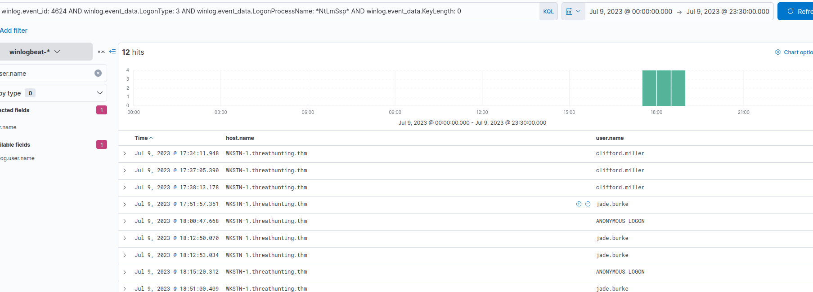
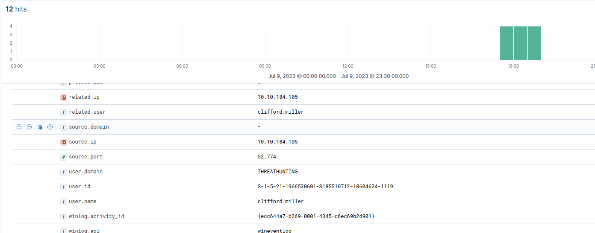

# Hunting Authentication via Pass-the-Hash

 we will use the winlogbeat-* index to hunt for indicators of Pass-the-Hash events from all hosts on July 9, 2023.

 When a threat actor dumps credentials from a compromised Windows host, they don’t always get the plaintext password. Most of the time, what they steal is the NTLM password hash.

 NTLM authentication does not require the plaintext password — it only needs the hash.

---
## Key PtH indicators in Windows logs

**Event ID: 4624 — Successful Logon**

This alone means nothing. Attackers log in successfully all the time.

What matters is the combination.

**Logon Type: 3 (Network)**

This indicates:

- Remote authentication

- SMB / WMI / PsExec / file share access

*PtH is almost always remote, not interactive.*

**LogonProcessName: NtLmSsp**

This tells you:

- NTLM was used

- Not Kerberos

Modern domains should prefer Kerberos. NTLM usage is already suspicious.

KeyLength: 0 ← this is the smoking gun

This is the part you must never forget.

KeyLength = 0 means:

- No encryption key was negotiated

- No password-derived session key

- Indicates hash-based authentication

In normal NTLM logons, KeyLength is usually:

* 56

* 128

So:
**NTLM + Network Logon + KeyLength 0 = High PtH suspicion**

**KQL** : winlog.event_id: 4624 AND winlog.event_data.LogonType: 3 AND winlog.event_data.LogonProcessName: *NtLmSsp* AND winlog.event_data.KeyLength: 0

In addition, ensure that the following fields are added as columns to aid us in our investigation:

- host.name
- user.name

Based on the results, it can be observed that two users (excluding ANONYMOUS LOGON, since it is a known false positive value) have potentially authenticated to WKSTN-1 via Pass-the-Hash. Moreover, it can be seen that the authentication of clifford.miller came again from the presumed compromised workstation 10.10.184.105.

To continue with the investigation, let's focus on clifford.miller's first log entry using the view surrounding documents feature.

