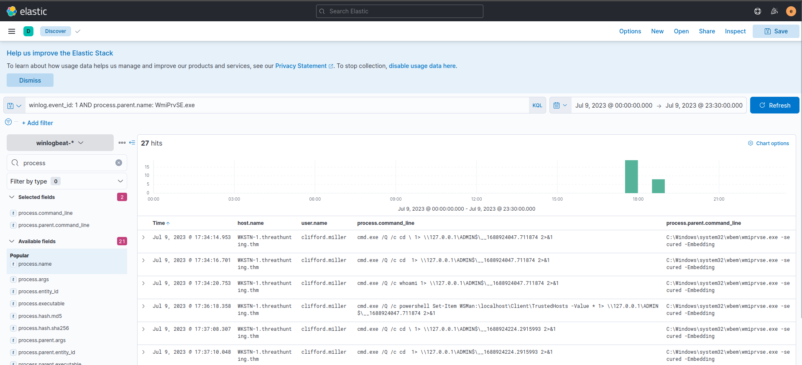

# Hunting Lateral Movement via WMI

we will use the winlogbeat-* index to hunt for potential lateral movement via Windows Management Instrumentation from all hosts on July 9, 2023.

Windows Management Instrumentation (WMI) is a built-in Windows service used by admins to:

- Run commands remotely

- Query system info

- Manage services and processes

- Automate tasks across many machines
---
KQL query to hunt unusual behaviour related to WMI:

winlog.event_id: 1 AND process.parent.name: WmiPrvSE.exe

In addition, ensure that the following fields are added as columns to aid us in our investigation:

- host.name
- user.name
- process.parent.command_line
- process.command_line

Based on the result The pattern, cmd.exe /Q /c * \ 1> \ \ 127.0.0.1\ADMIN$\ * 2>&1, is attributed to Impacket's wmiexec.py, a known tool for lateral movement. Given this, it confirms our suspicion of the events generated by WmiPrvSE.exe.

