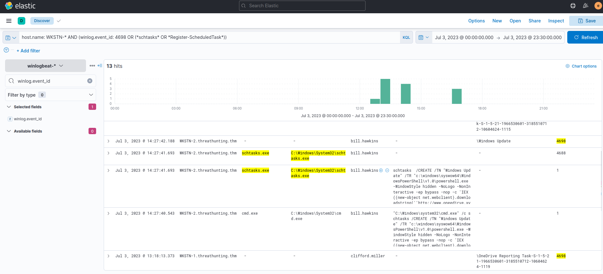

# Hunting scheduled task creation for persistance

 we will use the winlogbeat-* index and hunt for scheduled task creation attempts from employee workstations on July 3, 2023

## Evidence
 we can use Event ID 4698 (Scheduled Task Creation) or else we can use the following keywords for hunting commands related to scheduled tasks: schtasks and Register-ScheduledTask (PowerShell)

 **KQL** : host.name: WKSTN-* AND (winlog.event_id: 4698 OR (*schtasks* OR *Register-ScheduledTask*))

 In addition, ensure that the following fields are added as columns to aid us in our investigation:

* winlog.computer_name
* user.name
* process.command_line
* winlog.event_id
* winlog.event_data.TaskName

## conclusion

Based on teh results the unusual task created is named "Windows Update" and executes a PowerShell command scheduled every minute. 
