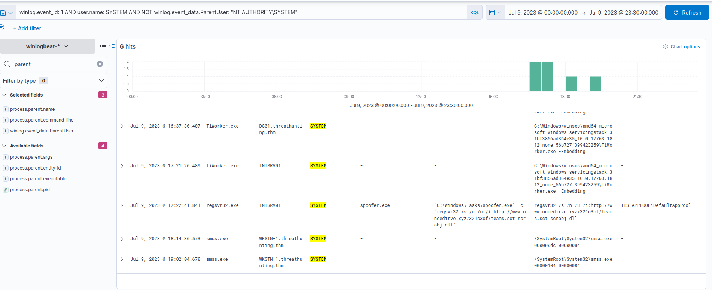
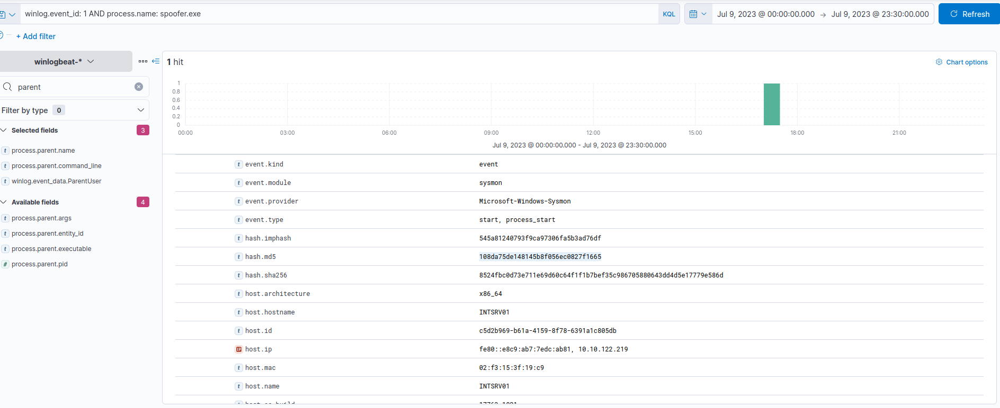
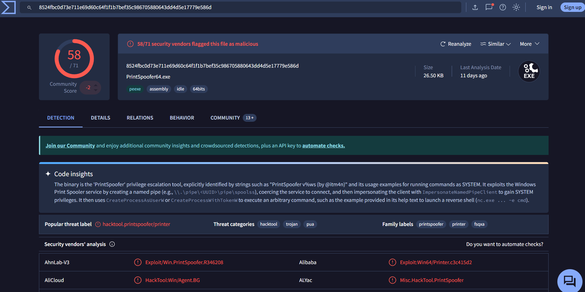

# Hunting for Abusing SeImpersonatePrivilege

 we will use the winlogbeat-* index to hunt for unusual processes spawned by the SYSTEM account from all hosts on July 9, 2023.

## Evidence

Using the Discover tab, we will hunt for processes spawned by the SYSTEM account accompanied by a parent process executed by a low-privileged account

**KQL** : winlog.event_id: 1 AND user.name: SYSTEM AND NOT winlog.event_data.ParentUser: "NT AUTHORITY\SYSTEM"

"A SYSTEM process was spawned by a NON-SYSTEM process."

In addition, ensure that the following fields are added as columns to aid us in our investigation:

- host.name
- user.name
- process.parent.command_line
- process.command_line
- winlog.event_data.ParentUser

Based on the result, this behaviour might indicate a potential remote code execution from a web server and a successful privilege escalation attempt.

Let's dig deeper by analysing the details of the spoofer.exe process using the following KQL query:

**KQL** : winlog.event_id: 1 AND process.name: spoofer.exe

let's use the binary's hash in VirusTotal and see if it is attributed to a known malicious binary.

# conclusion

The binary was identified as PrintSpoofer, which abused SeImpersonatePrivilege to escalate privileges from DefaultAppPool to SYSTEM, confirming successful privilege escalation.