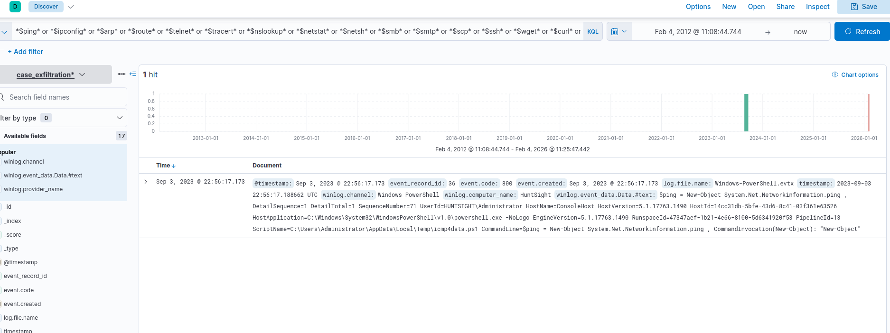
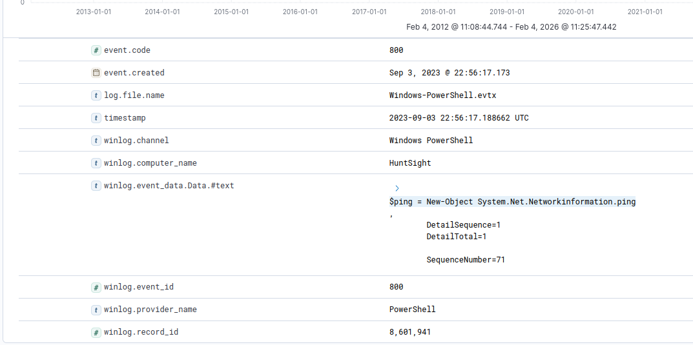
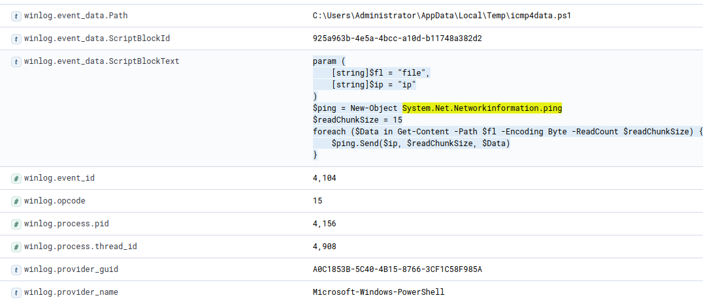

# Hunting data exfiltration over icmp

Exfiltration is a technique could be used by the adversaries or hacker to steal or leak data from teh target system or network.

Commonly used techniques are listed below:

- Traffic Duplication
- Data transfer over alternative protocols
- Data transfer over encrypted/unencrypted C2 Channel
- Exfiltration over web service and cloud storage mediums
- Exfiltration over Bluetooth and portable devices

*Modern data exfiltration often uses native tools, staged transfers, and encrypted C2 channels with controlled data sizes to evade network and host-based detection.*

We start with an overall search on process executions and pattern matching.
If the system raises alerts (for example suspicious ping activity, FTP usage, or abnormal network connections), we investigate those specific events.

If no alert exists, we proactively hunt for suspicious use of common native network and data transfer tools, such as:

- Network discovery: ping, ipconfig, arp, route, tracert, nslookup, netstat, netsh

- Data transfer: ftp, scp, ssh, wget, curl, certutil, tftp, Invoke-WebRequest

- Tunneling & covert tools: nc, ncat, socat, dnscat, ngrok, socks

- Staging & lateral movement: smb, smtp, psfile, psping, tcpvcon

We also look for behavioral indicators like:

- HTTPS POST requests

- SSL/TLS usage

- encoded or encrypted data

- chunked or repeated small transfers

These patterns help identify staged or stealthy data exfiltration.

**KQL** : *$ping* or *$ipconfig* or *$arp* or *$route* or *$telnet* or *$tracert* or *$nslookup* or *$netstat* or *$netsh* or *$smb* or *$smtp* or *$scp* or *$ssh* or *$wget* or *$curl* or *$certutil* or *$nc* or *$ncat* or *$netcut* or *$socat* or *$dnscat* or *$ngrok* or *$psfile* or *$psping* or *$tcpvcon* or *$tftp* or *$socks* or *$Invoke-WebRequest* or *$server* or *$post* or *$ssl* or *$encod* or *$chunk* or *$ssl*

There is one hit!

Now, let's continue hunting with the detected system call by running this filter:

   *System.Net.Networkinformation.ping *

 we filtered the following column to reveal if any executable file is involved in the suspicious activity:
 - winlog.event_data.Path

## conclusion
 The result shows a suspicious PowerShell script. Expand the log and look at the details. This script is transferring files using ICMP packets. In other words, it is a data exfiltration script!
