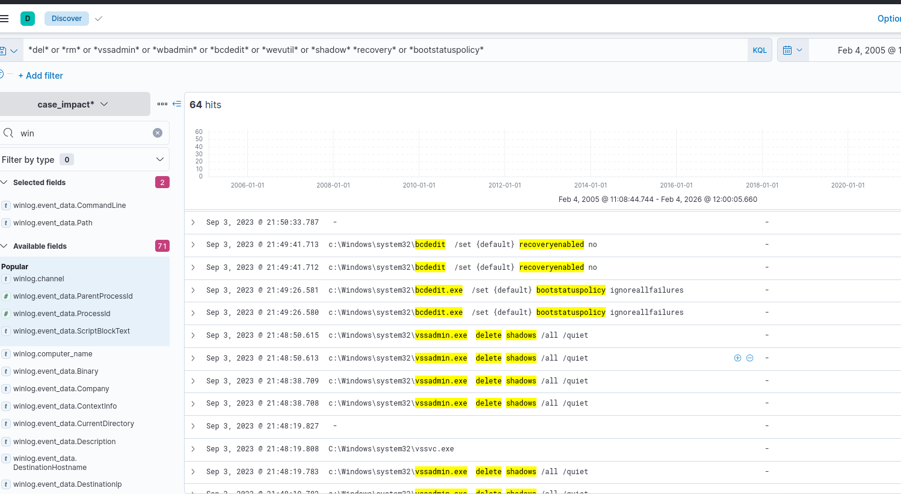
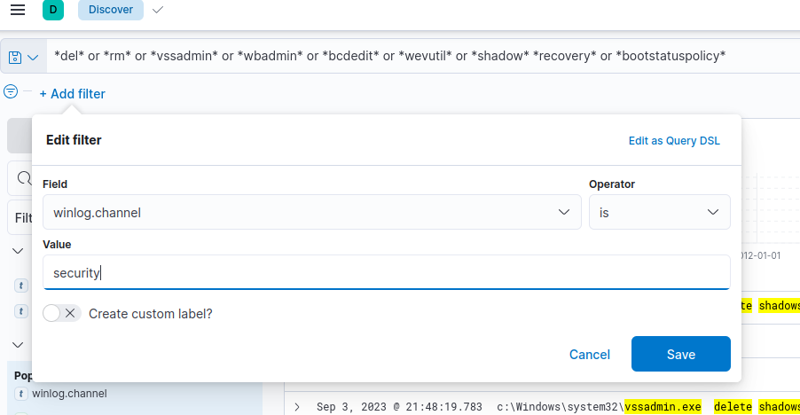
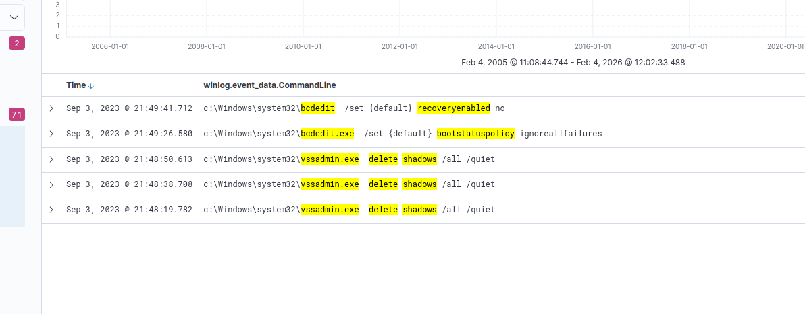

#  hunting for data destruction and recovery manipulation over native system processes.

The mini scenario is hunting shadow backup removal and system recovery point corruption, the same as the **Olympic Destroyer APT** group does. 

## Evidence

we will use overall search insights on process executions and pattern matches.

 We are looking for a system tool call that leads to system disruption and data manipulation. 

 **KQL** : *del* or *rm* or *vssadmin* or *wbadmin* or *bcdedit* or *wevutil* or *shadow* *recovery* or *bootstatuspolicy*

 

 lets add filter to narrow down the result:

 

 **BOOM!!!**

 

 We use timestamps to find the earliest suspicious activity, then filter by relevant Event IDs across all log sources to identify the true starting point of the attacker’s actions.

 - winlog.event_data.ProcessId : "1972"

 Updating the column filters to increase visibility:

- winlog.event_data.CommandLine
- winlog.event_data.ParentProcessName
- winlog.event_data.ProcessId
- winlog.event_data.ParentProcessId
- winlog.event_data.ParentImage

## conclusion
Based on the results, it can be seen that the revealed actions are targeted to disrupt the system by removing shadow copies and destroying the system recovery point/service.