# A Finance Director was recently phished. 

On Friday, September 15, 2023, Michael Ascot, a Senior Finance Director from SwiftSpend, was checking his emails in Outlook and came across an email appearing to be from Abotech Waste Management regarding a monthly invoice for their services. Michael actioned this email and downloaded the attachment to his workstation without thinking.

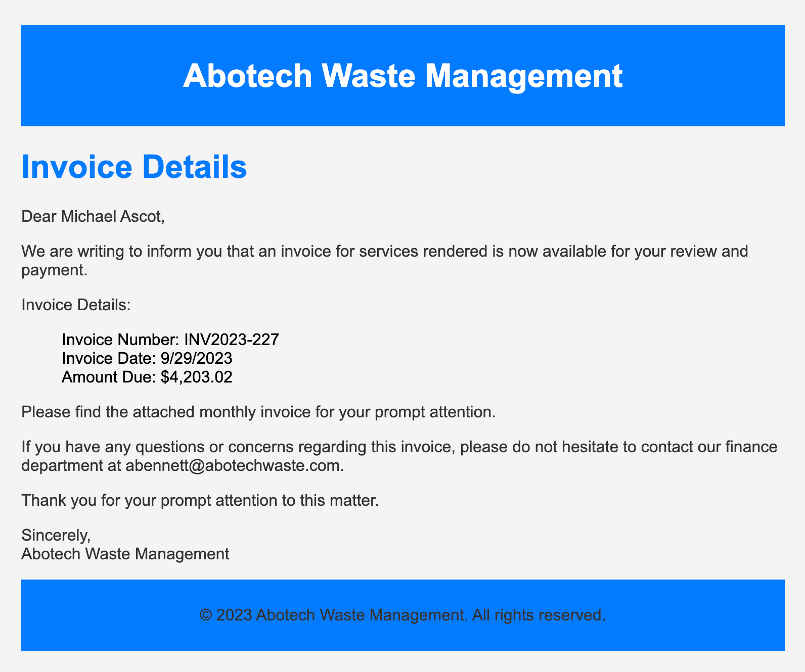

The following week, Michael received another email from his contact at Abotech claiming they were recently hacked and to carefully review any attachments sent by their employees.

 However, the damage has already been done. we will Use the attached Elastic instance to hunt for malicious activity on Michael's workstation and within the SwiftSpend domain!

## Evidence 

We will check what was the attachment download on that day:

**KQL** : user.name : Michael* AND process.name : OUTLOOK.exe AND winlog.event_id : 11

add the following column:

- file.path
-file.name

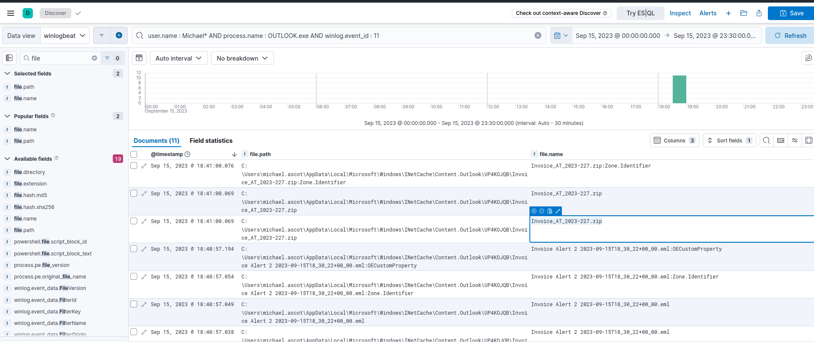

we came to know that micheal has downloaded the zip attachment file named :   *Invoice_AT_2023-227.zip*

next we will hunt for the the contained file that Michael extracted from the attachment

**KQL** : user.name : Michael* AND Invoice_AT_2023-227.zip

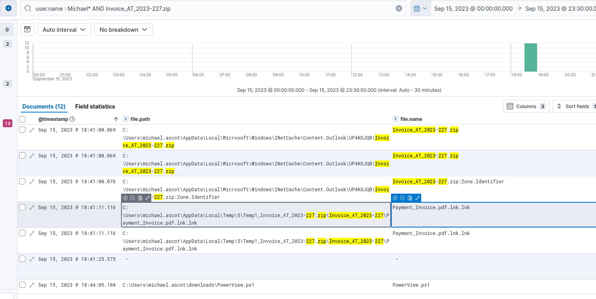

Now we see that *Payment_Invoice.pdf.lnk.lnk* was extracted from that zip file.

This is NOT a PDF.
This is a Windows shortcut (.lnk) pretending to be a document. so we do further investigation

add process.command_line

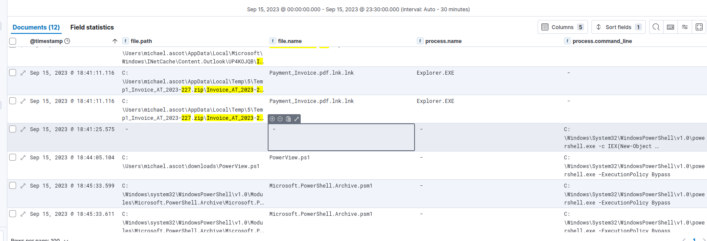

we can see that *powershell.exe* just spawned from the extracted file attachment. so its confirm that the attachment was malicious.

lets follow what was exactly executed by that powershell:

**KQL** : user.name : Michael* AND process.name : powershell.exe AND winlog.event_id : 1

add the following column 

- process.commandline
- process.name

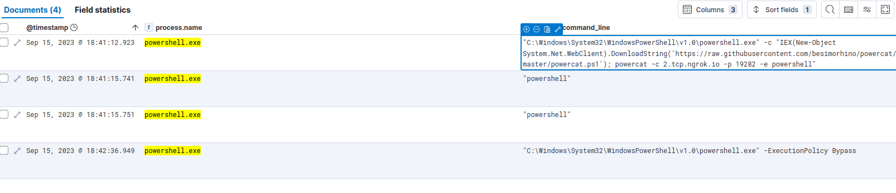

A PowerShell command downloaded powercat.ps1 from a public GitHub repository using DownloadString, executed it in memory, and used the tool to open a reverse PowerShell shell to 2.tcp.ngrok.io on port 19282.

Following the Cyber Kill Chain, we investigated post-compromise activity to determine what the attacker did after gaining access.

**KQL** : winlog.event_id : 1 AND user.name : *Michael* AND @timestamp > "2023-09-15T18:41:12.923"

add column: 
- process.name
- process.commandline

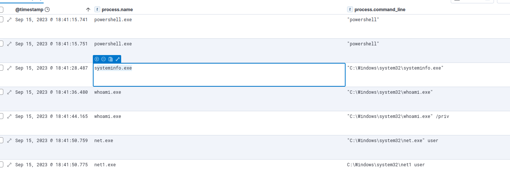

 we can observe that *systeminfo.exe* was the first native Windows binary the attacker ran for system enumeration after obtaining remote access.

lets move toward detecting enummeration

 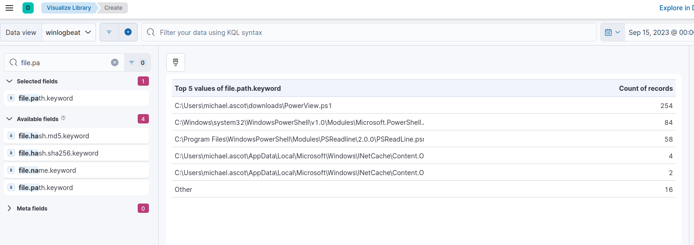

" https://raw.githubusercontent.com/PowerShellEmpire/PowerTools/master/PowerView/powerview.ps1 " is the URL of the script that the attacker downloads to enumerate the domain.

Unfortunately, there are no results for Event ID 5142 which logs when a network share object has been added.

We know, however, that the attacker is using powershell for execution, so we’ll filter for process creation events spawned by PowerShell.

**KQL**  : process.parent.name : powershell.exe AND winlog.event_id : 1

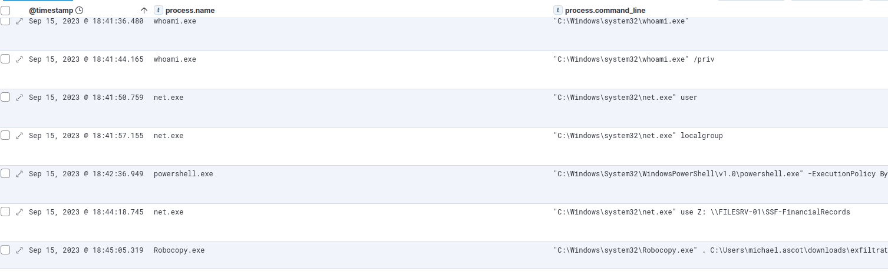

We can see many of the activities we’ve previously discovered, such as the execution of systeminfo, whoami, etc.

One noteworthy new finding, however, is the use of net.exe to add a mapped share.

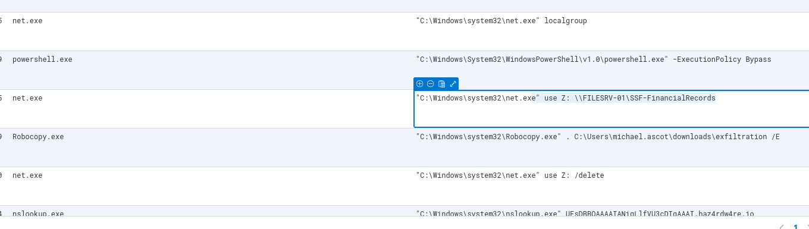

from the above We can see that the attacker mapped the *SSF-FinancialRecords* share to drive Z:
 
 the attacker copy the content of the shared file to the directory : C:\Users\michael.ascot\downloads\exfiltration  using robocopy.exe also the attacker delete the folder after the extraction.

 now lets see what the attacker has extracter from the folder

 we know that the attacker used robocopy so

 **KQL** : ( event.code : 1  AND process.parent.name : powershell.exe ) OR event.code : 11

 add the following column:
 - file.name
 - file.path

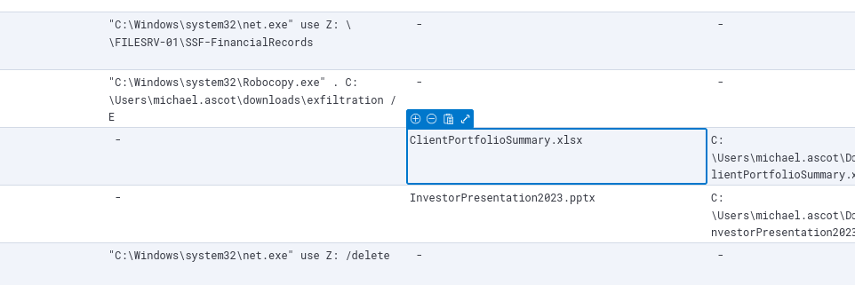

Now we can see that using robocopy.exe the attacker extracted two file:

- 	ClientPortfolioSummary.xlsx
- 	InvestorPresentation2023.pptx

After the attacker remove the mapped drive ,a new zip file (exfilt8me.zip) was created in the exfiltration directory.

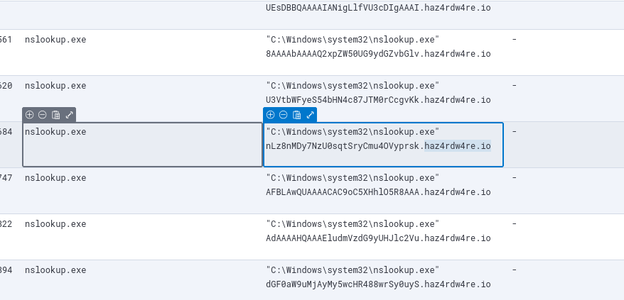

Lastly we can see that the attacker used nslookup which is a tool to exfiltrate data over dns and connect to the attacker server *haz4rdw4re.io* to retrived the exfiltarted data.

