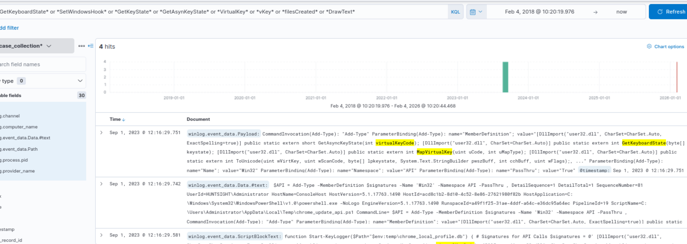
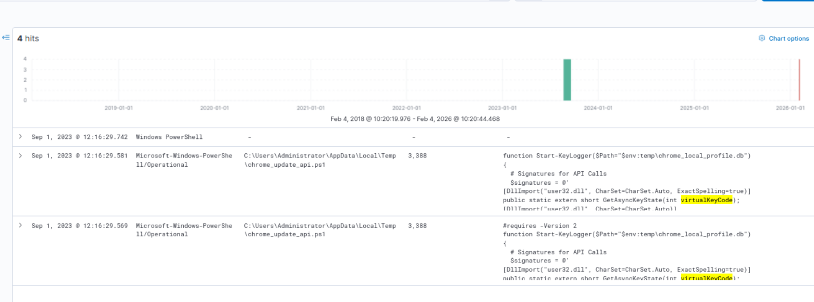
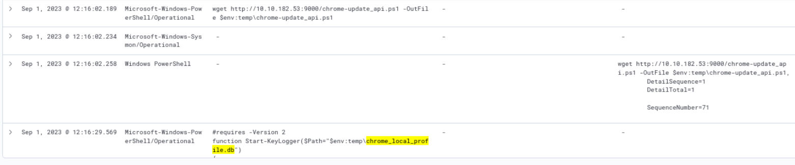
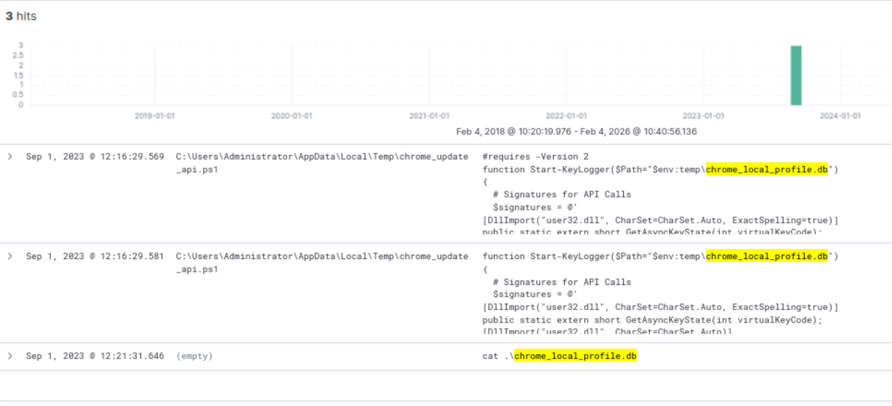

# Hunting key logging 

Keyloggers (also known as keystroke loggers) are tools/utilities that record all performed keyboard activities.

**Keylogging with API and function calls and common calls are listed below:**

- GetKeyboardState
- SetWindowsHook
- GetKeyState
- GetAsynKeyState
- VirtualKey
- vKey
- filesCreated
- DrawText

**Keylogging with low-level hooks common hooks are listed below:**

- SetWindowHookEx
- WH_KEYBOARD
- WH_KEYBOARD_LL
- WH_MOUSE_LL
- WH_GETMESSAGE

## Evidence

**KQL** : *GetKeyboardState* or *SetWindowsHook* or *GetKeyState* or *GetAsynKeyState* or *VirtualKey* or *vKey* or *filesCreated* or *DrawText*

Based on the results, it can be seen that there are multiple pattern matches in the given index. Implementing a quick filter also shows that the main visibility is coming from the following log file:

- Microsoft-Windows-PowerShell/Operational

Adding column filters shows the file contains the suspicious patterns.

 Selected columns:
- winlog.channel
- winlog.event_data.Path
- winlog.event_data.ScriptBlockText

Now we have the suspicious file name executed code block, which gives another suspicious file name.

understand the linked activities with the discovered files

**KQL** : *chrome-update_api.ps1* or *chrome_local_profile.db*

Note that we set the following columns to increase visibility:

- winlog.channel
- winlog.event_data.Path
- winlog.event_data.ScriptBlockText
- winlog.event_data.CommandLine
- winlog.event_data.Data.#text

The previous results show that the suspicious PowerShell file is downloaded using the 'wget' command and executed by the user. The executed file is a script; the details are visible in the applied columns. Based on the visible script lines, we can see that the second suspicious file is the keylogger's database.

lets dig deeper to find out more details about the database file

**KQL** : winlog.event_data.ScriptBlockText : "*chrome_local_profile.db*"

Updating the column filters to increase visibility:

- winlog.event_data.Path
- winlog.event_data.ScriptBlockText
- winlog.event_data.Payload

This result gives more insight into the database file. The 'cat' command is used to list/view the contents of files, so it may be possible to see the contents of the database file and discover the logged keystrokes.  

